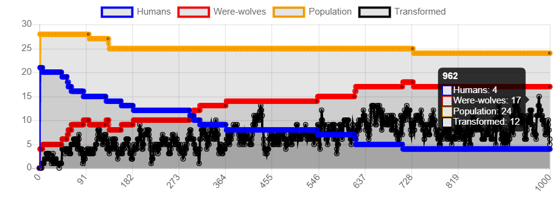
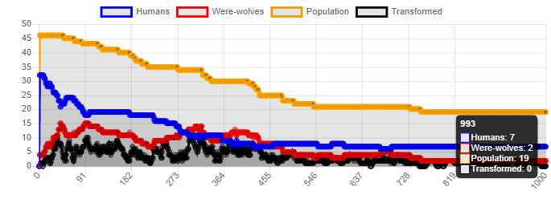
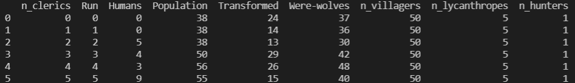

**Question 1-** Comment avez-vous fait pour que l'autre agent soit modifié. Cela vous paraît-il compatible de la définition d'agent que vous avez vue en cours? Argumentez votre réponse.

**Réponse** Pour changer l'état de l'autre agent en une personne infectée j'ai dû changé dans la méthode step qui lui est affecté, son attribut :
Afin que la méthode portrayal_method() de modifier l'apparence de l'agent, j'ai modifié l'attibut de la méthode step:
    
```python    
   villageois.lycanthrope= True
```
    
Ceci parait compatible avec la définition de l'agent caratérisé par la proactivité, l'adaptablité, la sociabilité et l'autonomie.

**Question 2-** Commentez le résultat de la simulation: Vers quoi le système converge-t-il? En combien de cycles? À votre avis, quel est l'impact de la présence de l'apothicaire? Celui de la quantité d'agents de chaque espèce? Justifiez votre réponse

**Réponse** 
On remarque que les vainqueurs sont les lycanthropes puisqu'on trouve après plusieurs runs que les loups-garous sont majoritaires.s.
L'apothicaire va aider les humains(villageois) à survivre. Mais son nombre ainsi que celui des châsseurs reste faible.


**Question 3-** Enregistrez les courbes encliquant avec le bouton droit sur la courbe, puis "Enregistrez l'image sous..." et comparez ces résultats à vos conjectures. Qu'en concluez-vous?

**Réponse**

**N.B : Je ne connais pas les expressions lambda.**


On remarque que la courbe des humains tends vers 0 après plusieures simulations alors que celle des lycanthropes augmente (la population diminue très lentement) tout comme notre conjoncture.


**Question 4-** Ajoutez aux paramètres le nombre de villageois sains, le nombre de lycanthropes, le nombre de chasseurs et le nombre d'apothicaires. Enregistrez les courbes qui vous paraissent pertinentes et commentez-les. Cela correspond-il à vos hypothèses? Qu'en concluez-vous?

**Réponse**
 La défaite des lycanthropes est possible si on augmente le nombre des villageois(30), des clerics(5) et des châsseurs(5) tel que le montre la vigure suivante:

 


**Question 5-** Sans faire les expériences associées, quels sont, selon vous, les paramètres qui auraient une influence sur le résultat de la simulation? Argumentez ces hypothèses. 

**Réponse**
A chaque pas, les chasseurs et les apothicaires affectent un seul humain alors que les loups transforment plusieurs. Ceci montre que la modification des apothicaires et des chasseurs ne va pas trop affecter le résultat. D'où Le paramètre qui aurait une influence sur le résultat de la simulation est le nombre des lycanthropes.

**Question 6-** Formulez une hypothèse argumentée sur le résultat de cette expérience.\n",
     
**Réponse**

Augmenter les apothicaires pourra sauver les lycanthropes qui ne sont pas encore transformés car un châsseur tout seul sans ou avec un nombre réduit d'apothicaires (ou un nombre réduit) ne pourra pas sauver les villageois.

**Question 7-** Comment interprétez-vous les résultats de cette expérience? Qu'en concluez-vous? 
 
**Réponse**
D'après ce tableau, la victoire des lycanthropes est sûre. On a commencé avec un grand nombre de villageois parmi lesquels seulement 9 ont survécu malgré la présence des apothicaires (5).



